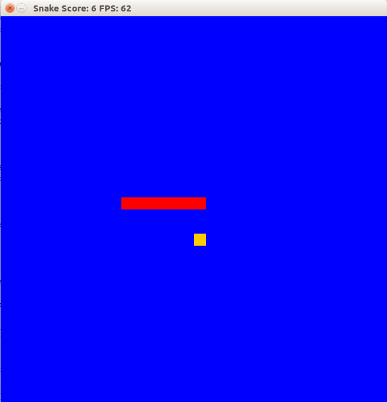
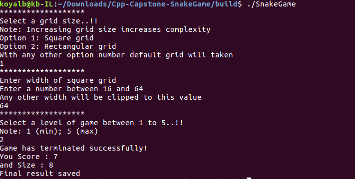
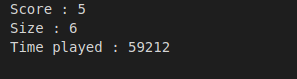
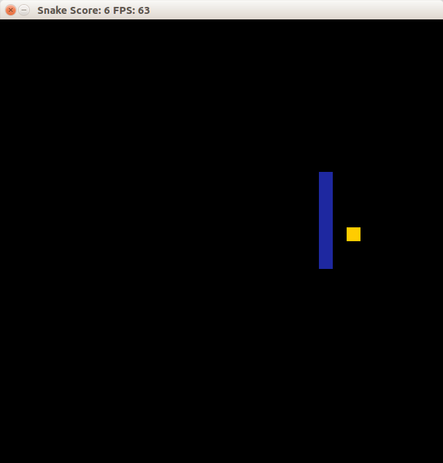

# CPPND: Capstone Snake Game Example

This is a starter repo for the Capstone project in the [Udacity C++ Nanodegree Program](https://www.udacity.com/course/c-plus-plus-nanodegree--nd213). The code for this repo was inspired by [this](https://codereview.stackexchange.com/questions/212296/snake-game-in-c-with-sdl) excellent StackOverflow post and set of responses.


The Capstone Project gives you a chance to integrate what you've learned throughout this program. This project will become an important part of your portfolio to share with current and future colleagues and employers.

In this project, you can build your own C++ application or extend this Snake game, following the principles you have learned throughout this Nanodegree Program. This project will demonstrate that you can independently create applications using a wide range of C++ features.

## Dependencies for Running Locally
* cmake >= 3.7
  * All OSes: [click here for installation instructions](https://cmake.org/install/)
* make >= 4.1 (Linux, Mac), 3.81 (Windows)
  * Linux: make is installed by default on most Linux distros
  * Mac: [install Xcode command line tools to get make](https://developer.apple.com/xcode/features/)
  * Windows: [Click here for installation instructions](http://gnuwin32.sourceforge.net/packages/make.htm)
* SDL2 >= 2.0
  * All installation instructions can be found [here](https://wiki.libsdl.org/Installation)
  * Note that for Linux, an `apt` or `apt-get` installation is preferred to building from source.
* gcc/g++ >= 5.4
  * Linux: gcc / g++ is installed by default on most Linux distros
  * Mac: same deal as make - [install Xcode command line tools](https://developer.apple.com/xcode/features/)
  * Windows: recommend using [MinGW](http://www.mingw.org/)

## Basic Build Instructions

1. Clone this repo.
2. Make a build directory in the top level directory: `mkdir build && cd build`
3. Compile: `cmake .. && make`
4. Run it: `./SnakeGame`.


## Class Structure

1. Game Changer :

This class is responsible for changing properties according to user input of render of full snakes game. It is been called in renderer class to set colour and different properties of game.

2. Renderer :

This class is used to set all variables of SDL library. So from setting screen format to setting snake parameters and updating frames is responsibility of this class.

3. Snake :

This class is responsible to set velocity and other snake related properties.


4. Controller :

This class is responsible for converting keyboard strokes to moving snake in game.

## Outputs of Code
Image of first configuration with Red snake and blue Board.



This is output of terminal which shows different results and events.



This is image of result text file generated by program and saved as Result.txt




## Rubric points and Portion of code

#### A README with instructions is included with the project

This is the readme with instructions of running , required libraries and rubric.

#### The README indicates which project is chosen.

Initial part of Readme is kept intact. So that shown that I am working on Snakes project for my Capstone Project.

#### The README includes information about each rubric point addressed.
This section of Readme is Ment for addressing this point.

#### The submission must compile and run.
Code compiles and Runs correctly their is no segmentation fault or any type of memory leak.

#### 1. The project demonstrates an understanding of C++ functions and control structures.

Various control structures and functions are used from for loops to switch cases in for example in following file
``` File : gamechanger.cpp Line 61 ```

#### 2. The project reads data from a file and process the data, or the program writes data to a file.

This program outputs ```Result.txt``` which has all important observations of that game like difficulty level, score, length of snake. ``` File : Game.cpp , Line : 98 ```

#### 3. The project accepts user input and processes the input.

We provide input of difficulty level from 0 to 10 and accordingly speed of snake is calibrated from low to high.
``` File : Snake.cpp, Line: 14 ```

#### 4. The project uses Object Oriented Programming techniques.

Class named Gamechange is made which has all required Object Oriented Programming Concepts and its object is used in renderer class.
``` File : gamechanger.cpp and gamechanger.h ```

#### 5. Classes use appropriate access specifiers for class members.

Appropriate class members used and private member has getter and setters as required. ```File : gamechanger.h```

#### 6. Class constructors utilize member initialization lists.

choice is a variable is set to 0 in the constructor which was not assigned any value which it was initializes.``` File : gamechanger.cpp Line : 5 ```

#### 7. Classes abstract implementation details from their interfaces.

All these properties can be seen in ``` File : gamechanger.h line 21 ``` their is abstraction of function convert and calibate .

#### 8. Classes encapsulate behavior.

All important data variables are private and are only accessable be getter and setter function. ``` File : gamechanger.h Line 15-18 ```

#### 9. Overloaded functions allow the same function to operate on different parameters.

I have a function named setSnakeColour it take one argument as vector<int> when choice is between 1-3 but if we want custom color of snake (Choice 4) then we use same funciton with 3 int arguments to set value of snake colour (RGB).
 
``` File : gamechanger.h Line 15 and 23 ```



This is custom colour functionality where snake colour be choose from all possible RGB combinations.

# !!!! Happy Coding !!!!
