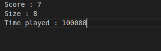

# CPPND: Capstone Snake Game Example

This is a starter repo for the Capstone project in the [Udacity C++ Nanodegree Program](https://www.udacity.com/course/c-plus-plus-nanodegree--nd213). The code for this repo was inspired by [this](https://codereview.stackexchange.com/questions/212296/snake-game-in-c-with-sdl) excellent StackOverflow post and set of responses.


The Capstone Project gives you a chance to integrate what you've learned throughout this program. This project will become an important part of your portfolio to share with current and future colleagues and employers.

In this project, you can build your own C++ application or extend this Snake game, following the principles you have learned throughout this Nanodegree Program. This project will demonstrate that you can independently create applications using a wide range of C++ features.

## Dependencies for Running Locally
* cmake >= 3.7
  * All OSes: [click here for installation instructions](https://cmake.org/install/)
* make >= 4.1 (Linux, Mac), 3.81 (Windows)
  * Linux: make is installed by default on most Linux distros
  * Mac: [install Xcode command line tools to get make](https://developer.apple.com/xcode/features/)
  * Windows: [Click here for installation instructions](http://gnuwin32.sourceforge.net/packages/make.htm)
* SDL2 >= 2.0
  * All installation instructions can be found [here](https://wiki.libsdl.org/Installation)
  * Note that for Linux, an `apt` or `apt-get` installation is preferred to building from source.
* gcc/g++ >= 5.4
  * Linux: gcc / g++ is installed by default on most Linux distros
  * Mac: same deal as make - [install Xcode command line tools](https://developer.apple.com/xcode/features/)
  * Windows: recommend using [MinGW](http://www.mingw.org/)

## Basic Build Instructions

1. Clone this repo.
2. Make a build directory in the top level directory: `mkdir build && cd build`
3. Compile: `cmake .. && make`
4. Run it: `./SnakeGame`.


## Class Structure

1. Levelsetter : This is a custom created class that handles fuctionalities related to the level of game i.e easy/medium/hard. The functionality that has been included is : 1. The class asks the user to input a lavel between 1 to 5. 1 corresponds to the lowest speed (easy) and 5 corresponds to the highest speed (hard). 2. The class also asks the user to input the grid size. A bigger grid size makes the game more difficult to play. A smaller grid size is easier to play with. Hence we can have a permutation combination of the above two features. This has been shown in ```levelsetter.cpp and levelsetter.h.```

2. Renderer : The Renderer class given by Udacity is used here. This now includes the new feature of custom grid size. 

3. Snake : The Snake class given by Udacity is used here. This now includes the new feature of custom level which sets the new speed of the snake.

4. Game : This is where the actual game runs from which the snake is made and the foods are placed.


## Rubric points and Portion of code

#### A README with instructions is included with the project

This is the README which includes the required instaructions.

#### The README indicates which project is chosen.

The chosen project is the Snake Game with added functionality of Level Setter.

#### The README includes information about each rubric point addressed.

This rubric is met in this readme.

#### The submission must compile and run.
Code compiles and Runs correctly with neither nay warnings or errors.

#### 1. The project demonstrates an understanding of C++ functions and control structures.

Various control structures and functions have used throughout the different implementations in the code. To mention specifically:
``` File : levelsetter.cpp Line 71 and Line 48 i.e From line 48 to Line 125.```
Lines 48 and 71 contains the beginning of the 2 functions which takes in user inputs i.e user_level() and user_grid().

#### 2. The project reads data from a file and process the data, or the program writes data to a file.

This program outputs ```final.txt. This can be seen in main.cpp : Line 28 to Line 34 ```
This contains informatio about the duration for which the game was played, the final score and the final size of the snake.

#### 3. The project accepts user input and processes the input.

``` File : levelsetter.cpp (Line 48 and Line 71) user_grid() and user_level() takes user inputs.``` The inputs taken by this class is further used for processing in 
```1.  snake.cpp in the function Speed() : Line 5 to Line 10.```
```2. renderer.cpp in the function setnewGrid() : Line 42 to Line 50```

#### 4. The project uses Object Oriented Programming techniques.

``` Files levelsetter.cpp and levelsetter.h makes use of various OOPS concepts. The objects of this class are used in snake.cpp and renderer.cpp ```

#### 5. Classes use appropriate access specifiers for class members.

In the file ```levelsetter.h``` private member getter and setters can be seen bein gmade use of, the implementation is there in the corresponding cpp file.

#### 6. Overloaded functions allow the same function to operate on different parameters.

The function ```setGrid()```  in class ```levelsetter.cpp```,  takes arguments in 2 forms. If the user wants a square grid size, the function on ```Line 31``` is called, else the function on ```Line 36``` is called if the user wants a rectangular area. The implementation is in the corresponsing header ```levelsetter.h```.

#### 7. Class constructors utilize member initialization lists.

Level is set to a default value of 0 in the constructor.``` File : levelsetter.cpp Line : 5 ```

#### 8. Classes encapsulate behavior.

All important data variables are such as game level, grid width and height are made private and are only accessable be getter and setter function. ``` File : levelsetter.h Line 27-30 ```

``

## Outputs of Code


This is output of terminal which shows different results and events.


This is image of result text file generated by program and saved as Result.txt



